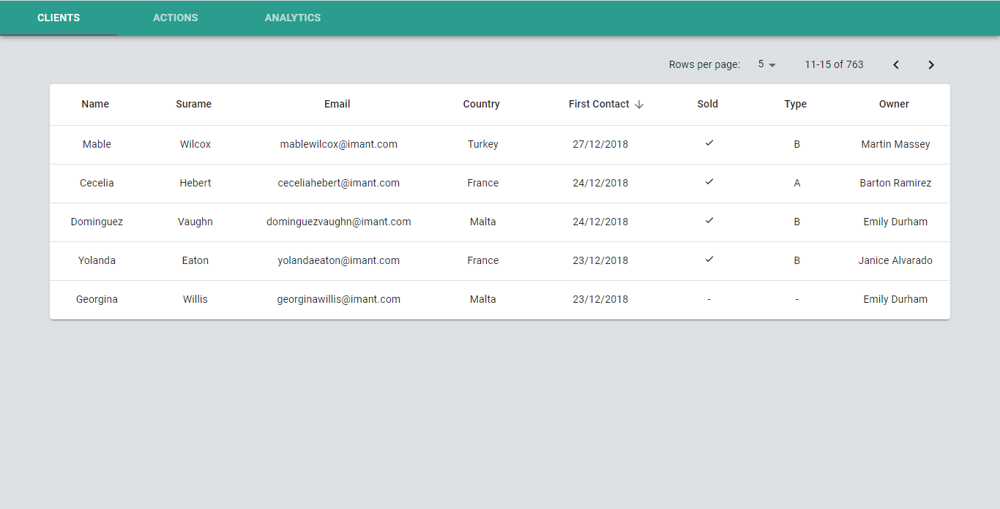
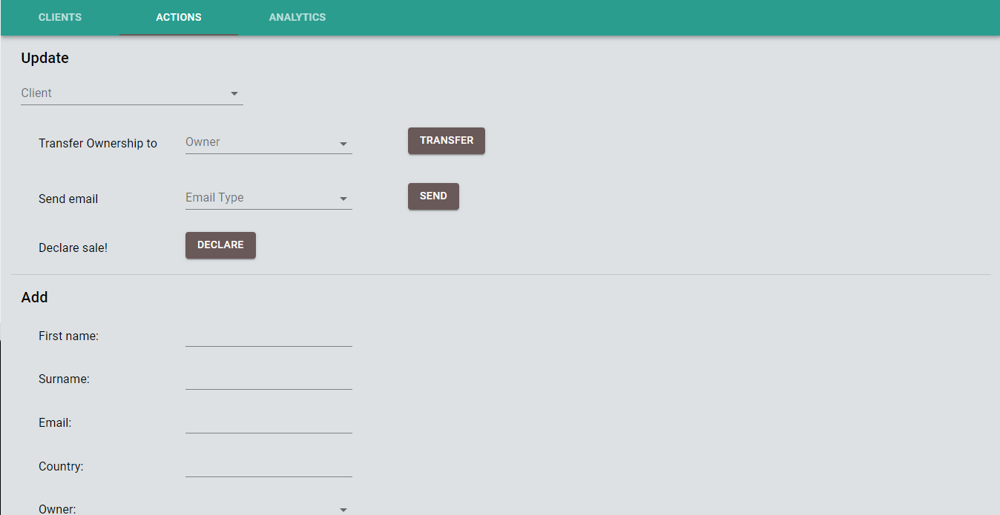
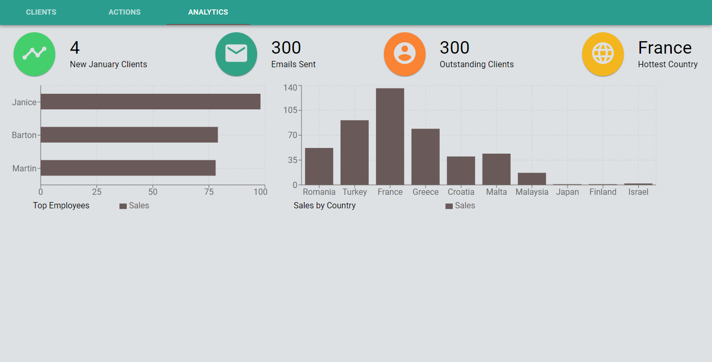

# A CRM App

A client relationship manager.

## Technologies

Frontend done with: React, MobX, Material UI and Recharts for the charts.
Backend done with: express, sequelize and MySQL as the DB.

### Clients page

Allows the user to see all the clients the company has relations with right now and change their basic data.

### Actions page

Allows the user to add clients and update the important data (declare sales, send emails and switch handler).

### Analytics

Shows different info and statistics.